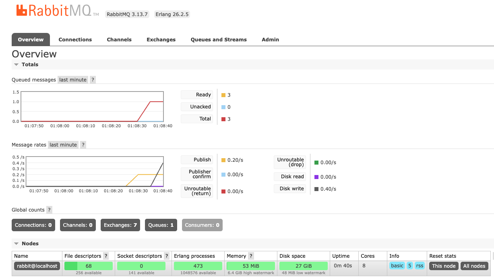

# Practica RabbitMQ

* Se usa la guia practica presentada por el profesor para realizar una sencilla implementación de RabbitMQ en un poryecto simple. Este proyecto contiene una clase publicadora que escribe mensajes en una cola, tambien contiene una clase receptora que lee los mensajes en la misma cola.

* Los mensajes se forman a partir de una clase tipo objeto la cual se convierte a un JSON para ser enviado en el mensaje. 

* La clase recptora hace el proceso de deserialziar el JSON para hacer uso de los datos.

* El respectivo control de errores se hace implementanto los try/catch correspondientes en las funciones que puedan propagar errores.

## Demostraciones de uso

### Publicador

### Receptor

### Control de errores cuando la conexion a RabbitMQ no esta activa

### Panel RabbitMQ

## Integrantes
* Sergio Rodriguez Taborda

